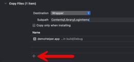
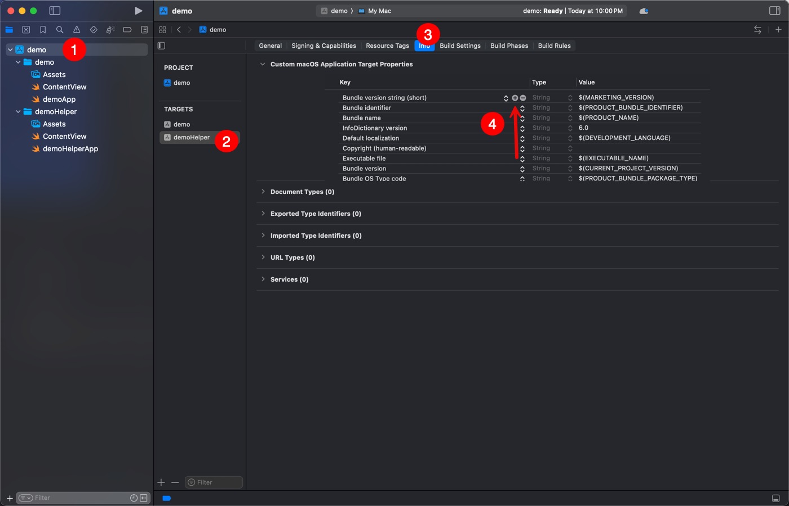

## Why the guide? 
Apparently, it's more difficult than you'd think to get a **sandboxed** app to support Login Items. 

If you're building a non-sandboxed app (IE: it's not going to the App Store) - this is way easier with a LaunchAgent plist. Check out my guide here for that. 

**NOTE:** This app will not show up under "Open on Login" under System Settings -> General -> Login Items. This was a massive misconseption on my end. Apps using the sandboxed methods will show up under System Settings -> General -> Login Items & Extensions -> **Allow in the Background**.

## How does this all work?
Since sandboxed apps have no access to the file system outside of the user-level foldes / files you may specify, these apps have no access to user level or system level folders like LaunchAgents / LaunchDaemons. 

Instead, we must build a **helper app** that just **opens** our app. 

We use the `SMAppService.loginItem(identifier: "Your Main App Bundle ID")` framework to register our helper with the OS. 

Sample project is provided in the GitHub Repository.

It's confusing at first - ***we have to build another app to open our app?!*** but follow along & it's really not that bad. 

## Step by Step - Project Setup
Click the images to increase size.

1. **Make a new Xcode Project.**  
   - Select **App** under macOS.
   - Specify your Product Name. 

  

 

2. **Add a Helper App Target (for the Login Helper):**  
"Open on Login" requires a Helper App. 
   - **File > New > Target...**  
   - (Scroll down) Choose **Application > App** (again), but name this one something like `MyAppHelper`.

3. **Configure the Main App to include your Helper App:**
   - In the Project Navigator, select your **Main Root Level project** (blue icon).
   - Go to **Build Phases**.
   - Click your **Main App** under **Targets**
   - Click **+** and choose **New Copy Files Phase**.
     - **Destination:** Wrapper
     - **Subpath:** `Contents/Library/LoginItems` *(no spaces!)*
     - Add your Helper app **product** to this phase.

  

  

  

 

4. **Set Build Settings for the Helper Target:**
 
This prevents the **Helper App** from compiling a .app when you Archive the project. You don't need a separate .app exposed - it is copied into the main .app bundle in step 3. 

- Select the **Helper target**.
- Go to **Build Settings**.
- Set **Deployment > Skip Install** to **Yes**.

  

 

5. **Set Info.plist for Helper Target:**
 
This prevents the helper app from displaying a dock icon when you login to your machine.

- Select **Helper target** > **Info** tab.
- Add the key:  
  - **Application is background only:** YES  
       (Sets `LSBackgroundOnly` in Info.plist)

  

  

 

## Step by Step - Add Code

1. **Delete the ContentView.swift in the Helper app**
 
Helper app does not have UI. Lets delete the UI file. 

  

 

2. **Add Code to Helper app**
- Go to the GitHub repo and copy paste the code from "Helper.swift" into your remaining `.swift` file in the Helper App. 
- Modify the `let mainAppBundleID` line. Make sure you specify the bundle ID of your ***main app target***. 

3. **Add main.swift to Helper target app**
- Go to the GitHub repo and copy paste the code from "Helper.swift" here. 
- This file is **required** and I can't get it to work in a single file.
  - Since the app has no UI, adding a `@main` doesn't work.
  - Adding the code from `main.swift` to the bottom of `helper.swift` doesn't work due to Swift 6 limitations.
  - Doing the `Helper.swift` and `main.swift` is a surefire way to have the Helper actually execute. 
- Ensure `let delegate = LoginItemHelperApp()` is the name of your class in `Helper.swift`. 

4. **Update ContentView.swift in the main app target**
- Go to the GitHub repo and copy paste the code from "ContentView.swift". 
- Modify the `private static let loginHelperIdentifier` line. Make sure you specify the bundle ID of your **helper app**. 

5. **Ensure Signing is correct**
- You want to ensure both of your app targets (main app, helper app) are signed with the same developer certificate. Otherwise it won't work. 
---

## Quick Reference

- **Add Helper App:**  
  `File > New > Target > Application > App`

- **Copy Helper into Main App Bundle:**  
  Main app > **Build Phases** > **+ New Copy Files Phase**  
  - Destination: Wrapper  
  - Subpath: `Contents/Library/LoginItems`  
  - Add Helper app

- **Set Helper Skip Install:**  
  Main app > **Build Settings**  
  - Helper Target > Deployment > Skip Install: Yes

- **Set Helper as Background Only:**  
  Main app > **Helper Target > Info**  
  - Add key: *Application is Background Only*: YES

- **Copy code from GitHub Repo**

- **Updated corresponding lines for the Bundle ID's in both apps**

- **Ensure signing is accurate**

 

---

# Troubleshooting

Few things I have learned from getting this to work. 

- Testing helper apps from inside Xcode can be painful. I found that doing an Archive / or copying the app bundle to a VM to be the best way to test. 
- You can include `nslog()` to the helper app and use `Console.app` and filter by your helper apps Bundle ID to search for log messages. 
- Ensure that your helper is copying correctly - open Main.app/Contents/Library/LoginItems/Helper.app/Contents/MacOS/
- Try launching Helper.app (inside your Main.app) - does it work? 

